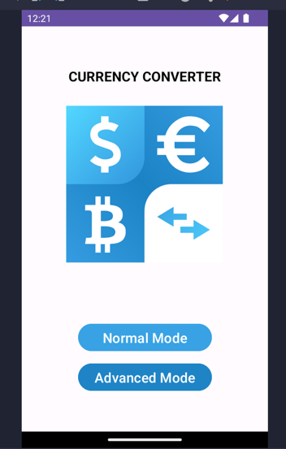
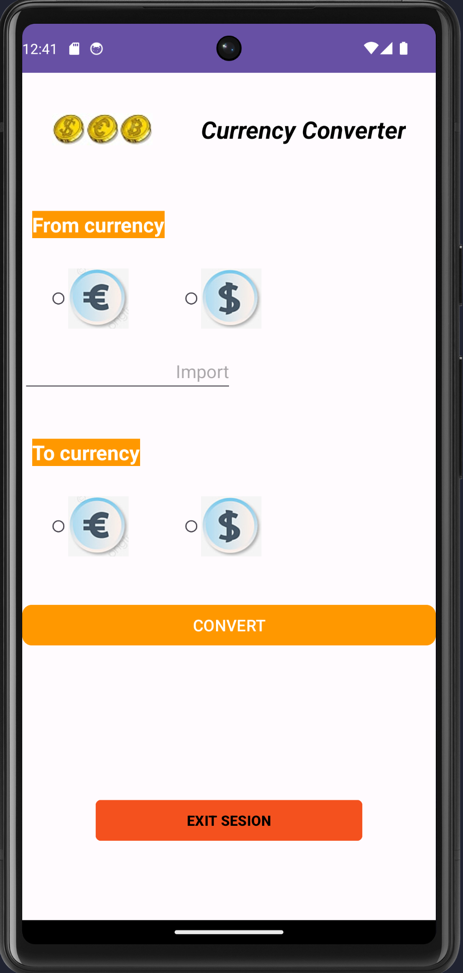
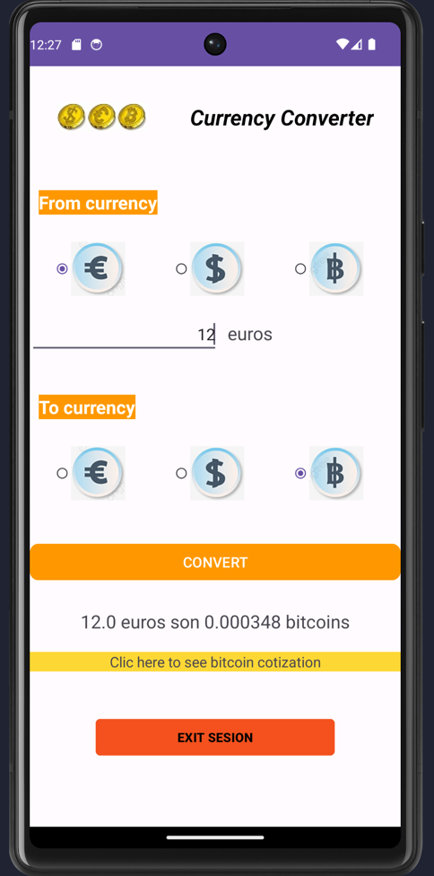
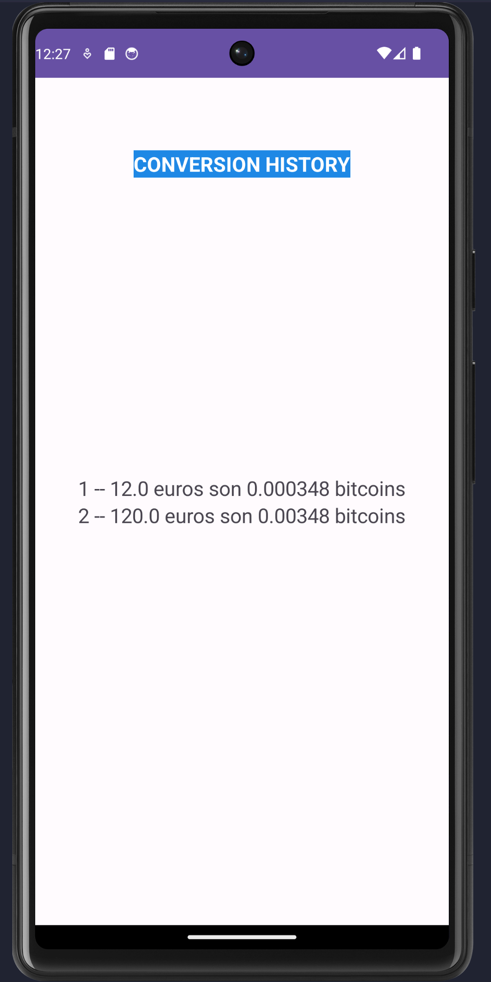

# Conversor de Monedas

Este proyecto de Android es un conversor de monedas que te permite convertir entre diferentes tipos de monedas. Tiene dos modos: normal y avanzado, y también cuenta con un historial de conversiones realizadas.

## Modo Normal

En el modo normal, puedes convertir entre euros y dólares. Simplemente ingresas la cantidad en una moneda y seleccionas la moneda de destino, y el conversor realizará la conversión automáticamente.

## Modo Avanzado

En el modo avanzado, además de euros y dólares, también puedes convertir bitcoins. Este modo es ideal para usuarios más experimentados en el mundo de las criptomonedas.

## Historial de Conversiones

El conversor de monedas también guarda un historial de todas las conversiones realizadas. Esto te permite revisar las conversiones anteriores y tener un registro de tus transacciones.

