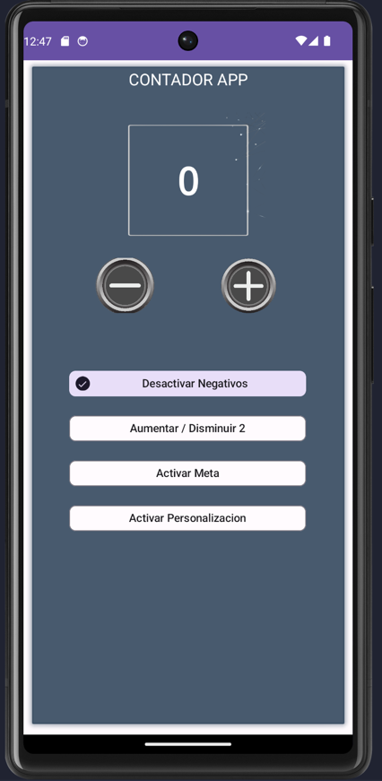

# Contador App

La Contador App es una aplicación de Android que te permite llevar un registro de tus cuentas de una manera sencilla y personalizable.

## Características principales

- **Contador personalizado:** Puedes establecer colores al contador.
- **Desactivar negativos:** Si lo deseas, puedes desactivar los números negativos en el contador.
- **Incremento de 2 en 2:** La aplicación te permite incrementar el contador de 2 en 2 en lugar de 1 en 1.
- **Establecer una meta:** Puedes establecer una meta para el contador y recibir notificaciones cuando la alcances.

## Capturas de pantalla

Aquí tienes algunas capturas de pantalla de la Contador App en acción:

¡Disfruta de la Contador App y lleva un registro fácil y personalizado de tus cuentas!
