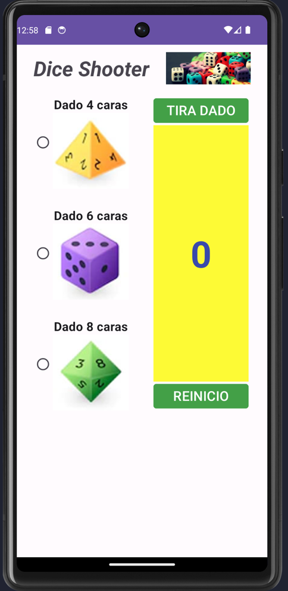
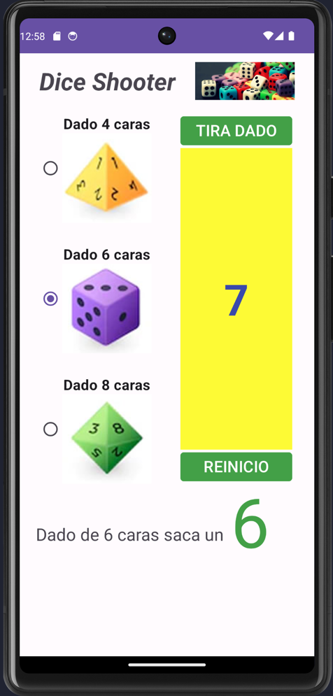
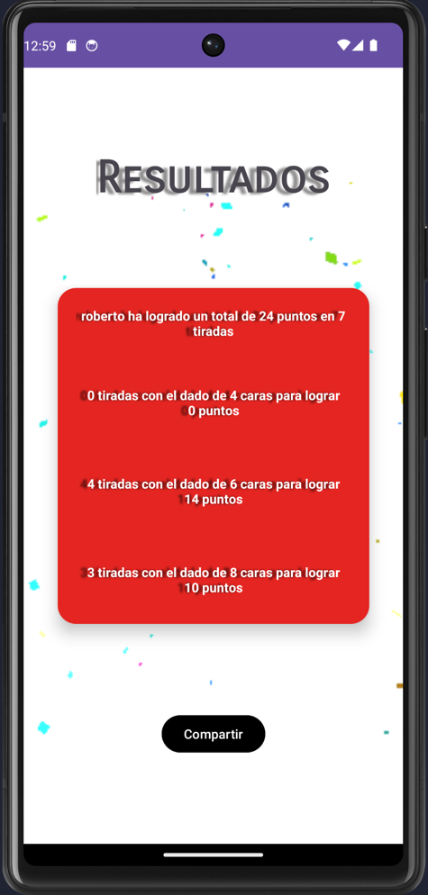

# Tirador de Dados

## Descripción

La aplicación Tirador de Dados es una herramienta divertida que te permite lanzar diferentes tipos de dados y llevar un registro de tus tiradas y puntuación. Con esta app, podrás disfrutar de juegos de mesa y de rol sin necesidad de tener dados físicos a mano.

## Características

- Lanza diferentes tipos de dados, como d4, d6 Y d8.
- Reinicia el conteo de tiradas y puntuación en cualquier momento.
- Visualiza cuántas tiradas te ha llevado alcanzar un total de 24 puntos.
- Registra qué dado has utilizado en cada tirada.
- Pantalla de resumen con el historial de tiradas y puntuación acumulada.

## Capturas de pantalla

## Tecnologías utilizadas

Esta aplicación ha sido desarrollada utilizando el framework Android.

¡Descarga la app y diviértete lanzando dados!

