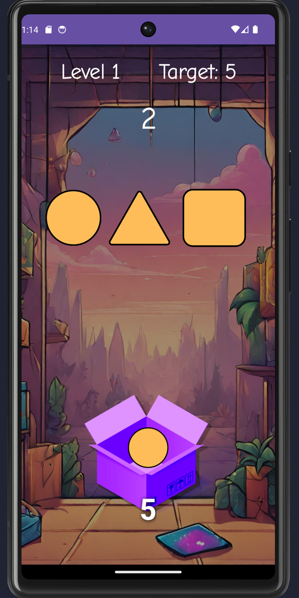
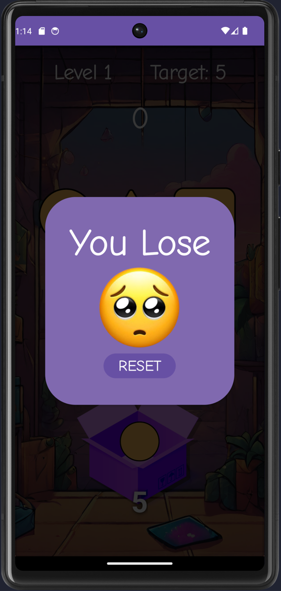
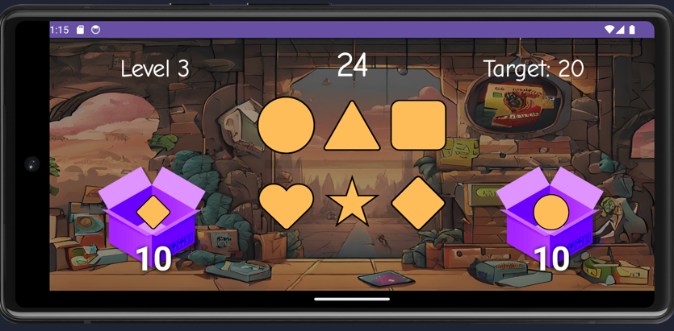

# Drag and Pop

## Descripción
Drag and Pop es un juego adictivo en el que debes arrastrar y soltar figuras en una caja antes de que se acabe el tiempo. Cuenta con tres niveles de dificultad y es compatible con el modo landscape. A medida que avanzas en los niveles, la dificultad aumenta, ya que hay más figuras y se agregan dos cajas.

## Características
- Arrastra y suelta figuras en la caja antes de que se acabe el tiempo.
- Tres niveles de dificultad.
- Modo landscape compatible.
- Aumento de la dificultad en cada nivel.

## Capturas de pantalla

## Tecnologías utilizadas
- Android
