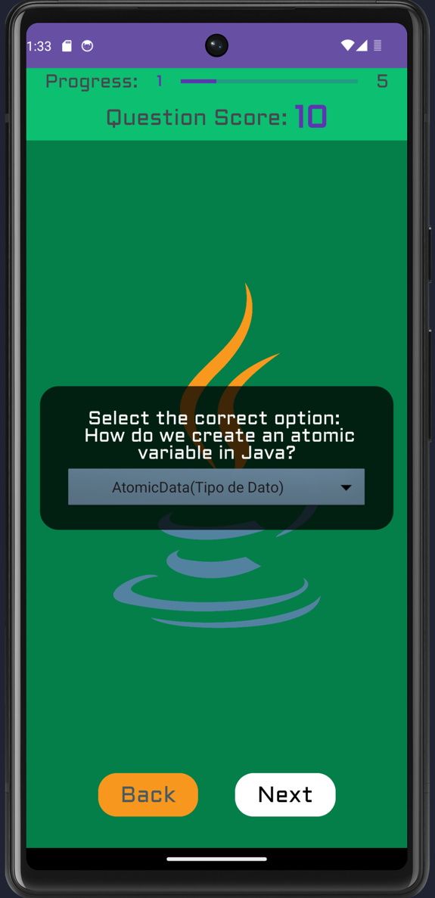
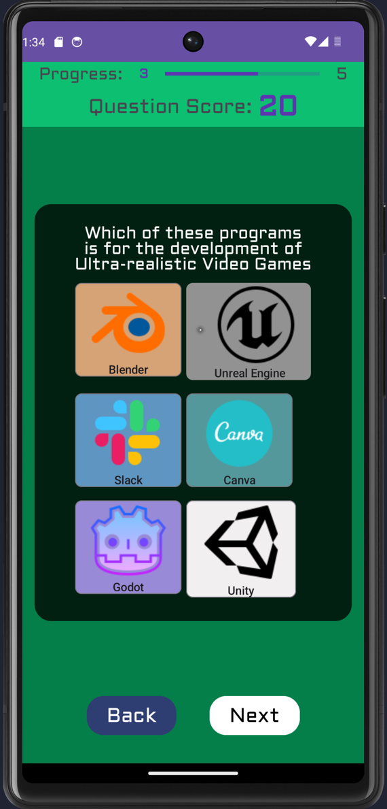
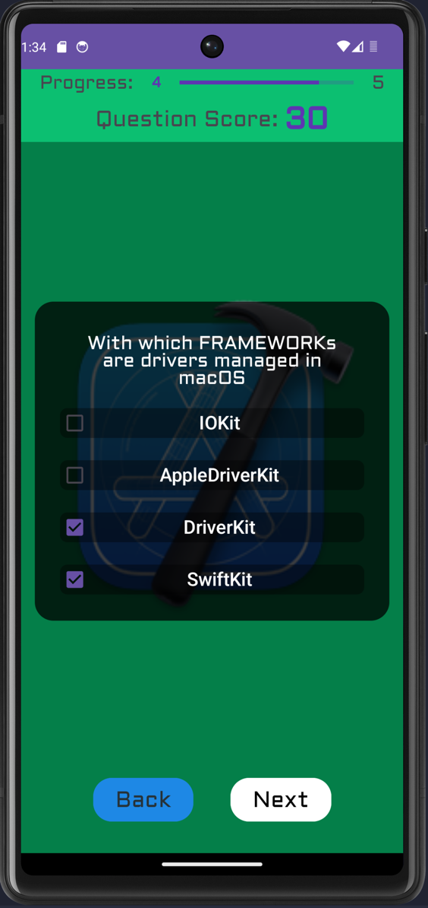
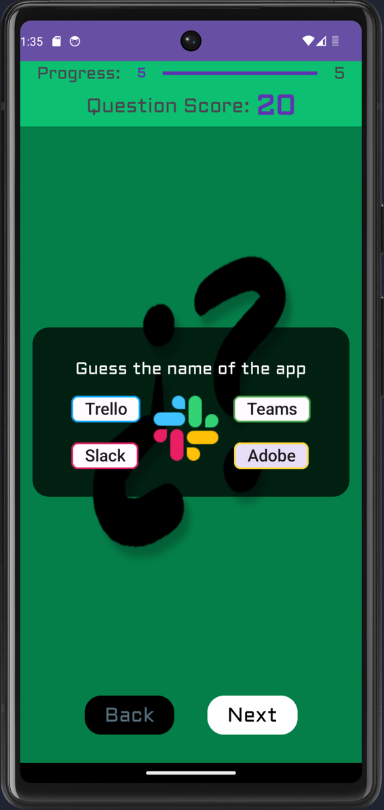
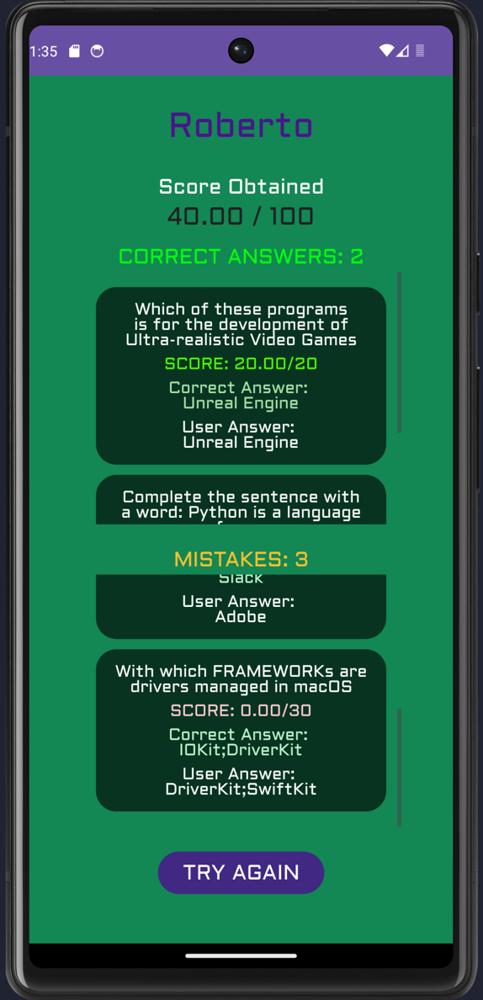

# Cuestionario de Tecnología

## Descripción
El Cuestionario de Tecnología es una aplicación móvil diseñada para poner a prueba tus conocimientos en el campo de la tecnología. Consta de 5 preguntas únicas, cada una con un diseño personalizado, y te permite navegar entre ellas. Al finalizar el cuestionario, podrás ver las preguntas acertadas y falladas, así como un resumen breve de tu desempeño.

## Características
- Cuestionario de 5 preguntas sobre tecnología
- Diseño único para cada pregunta
- Navegación intuitiva entre las preguntas
- Visualización de preguntas acertadas y falladas
- Resumen de desempeño al finalizar el cuestionario

## Capturas de pantalla

## Tecnologías utilizadas
- Android
- Java
- Actividades y Fragmentos para la navegación y visualización de preguntas
- Progreso y puntuación de cada pregunta mediante un Fragmento

¡Disfruta poniendo a prueba tus conocimientos tecnológicos con el Cuestionario de Tecnología!