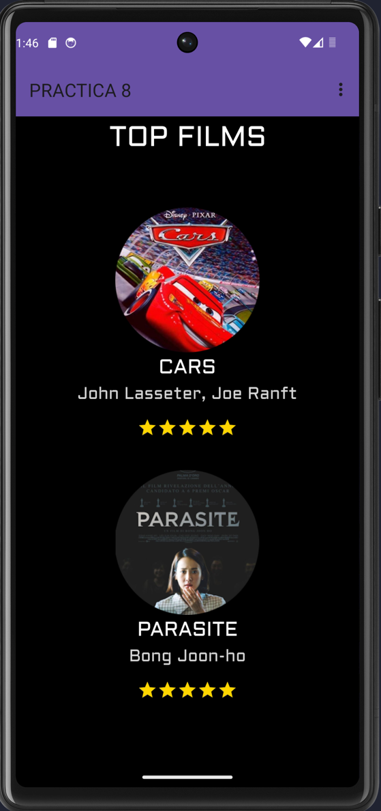
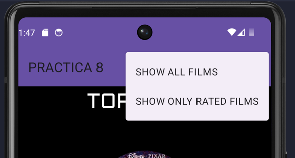
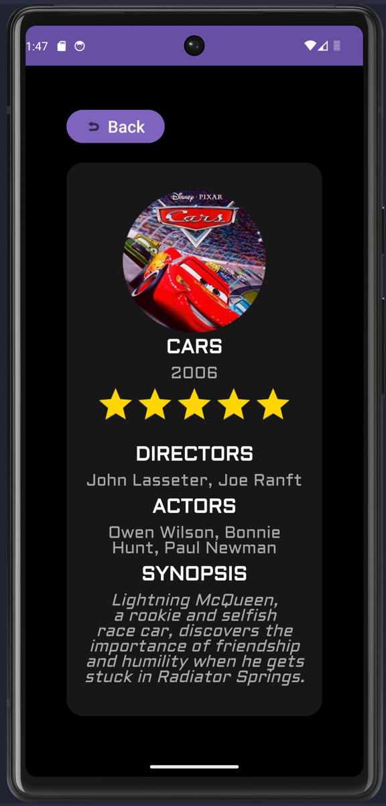
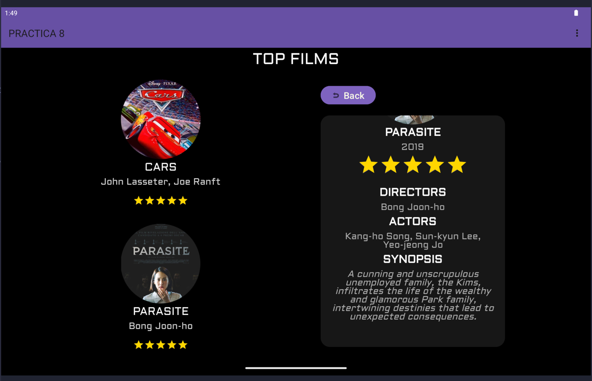

# App Peliculas

## Descripción
Esta aplicación es un catálogo de películas que permite modificar la puntuación de cada película. Además, cuenta con un fragmento dinámico para cargar las películas y una interfaz especial para tablets en modo landscape, tambien puedes mostar las peliculas que tengan una valoracion superior a 0

## Características
- Catálogo de películas (Recycler View)
- Modificación de puntuación de películas
- Fragmento dinámico para cargar películas
- Interfaz especial para tablets en modo landscape
- Filtrado de peliculas en base a la puntuacion

## Capturas de pantalla

## Tecnologías utilizadas
- Android
