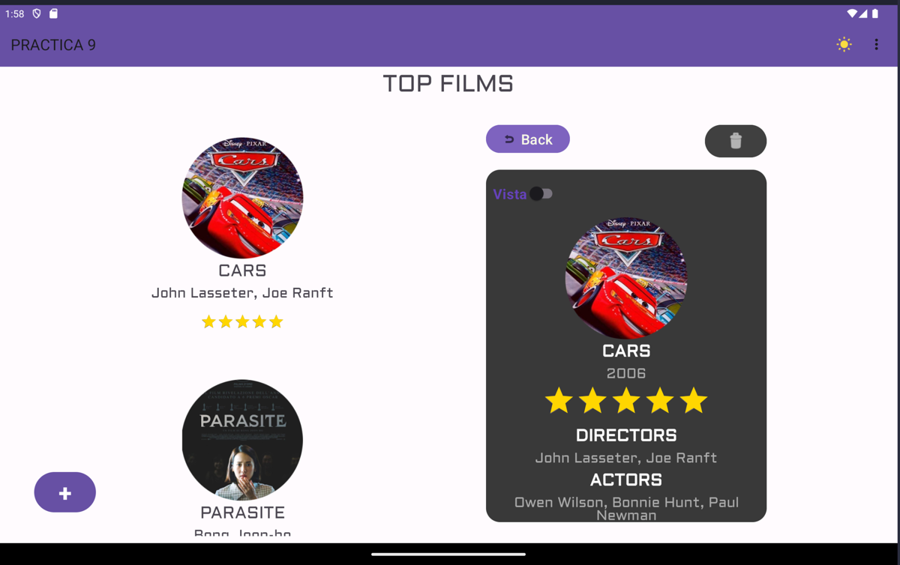
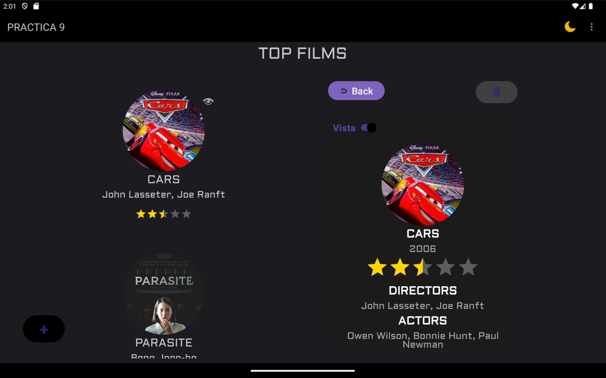
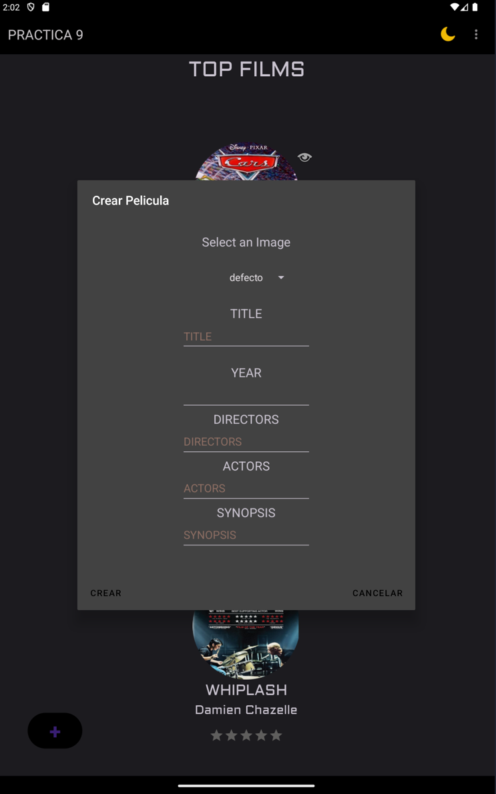

# App Peliculas V2

## Descripción
La aplicación es una versión mejorada de la app de películas anterior. Permite realizar modificaciones en las películas y guardar los cambios en una base de datos, borrar pelicula y añadir pelicula. Además, cuenta con la funcionalidad de cargar películas desde la base de datos. La aplicación también utiliza preferencias para guardar la configuración del tema, permitiendo al usuario elegir entre un tema oscuro o tema diurno. Se puede filtar por peliculas vistas, las peliculas se pueden marcar como vistas.

## Características
- Modificación de películas
- Guardado de cambios en base de datos
- Carga de películas desde la base de datos
- Configuración de tema oscuro o tema diurno
- Filtrado en el recycler view

## Capturas de pantalla

## Tecnologías utilizadas
- Android
- Base de datos
- Preferencias
