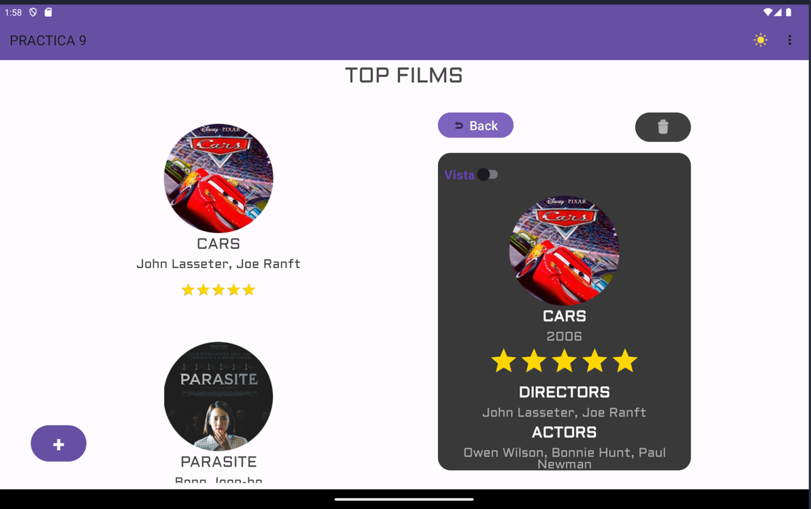

# Mis Proyectos 2DAM Desarrollo Android

## Primer Trimestre

### EXAMEN 1EVA CONVERSOR MONEDAS

Descripción del proyecto [Examen1EVA](1EVA/Examen1Ev1_RJT/README.MD).

### PRACTICA 3 CONTADOR

Descripción del proyecto [PRACTICA1](1EVA/PRACTICA1/contadorApp/).

### PRACTICA 4 TIRAR DADOS

Descripción del proyecto [PRACTICA4](1EVA/PRACTICA4/Proyecto4_rjt/)

### PRACTICA 5 MINIGAME DRAG-AND-POP

Descripción del proyecto [PRACTICA_MINIGAME](1EVA/PRACTICA_MINIGAME/)

# Segundo Trimestre

### PRACTICA 6 Cuestionario de Tecnología (FRAGMENT)

Descripción del proyecto [Practica6](2EVA/Practica6/)

### PRACTICA 7-8 App de Peliculas (RECYCLER VIEW AND FRAGMENTS DINAMICOS)

Descripción del proyecto [practica7](2EVA/practica7/)

### PRACTICA 9 App de Peliculas v2 (PERSISTENCIA DE DATOS, Prefs, SQLite)

Descripción del proyecto [practica9](2EVA/practica9/)